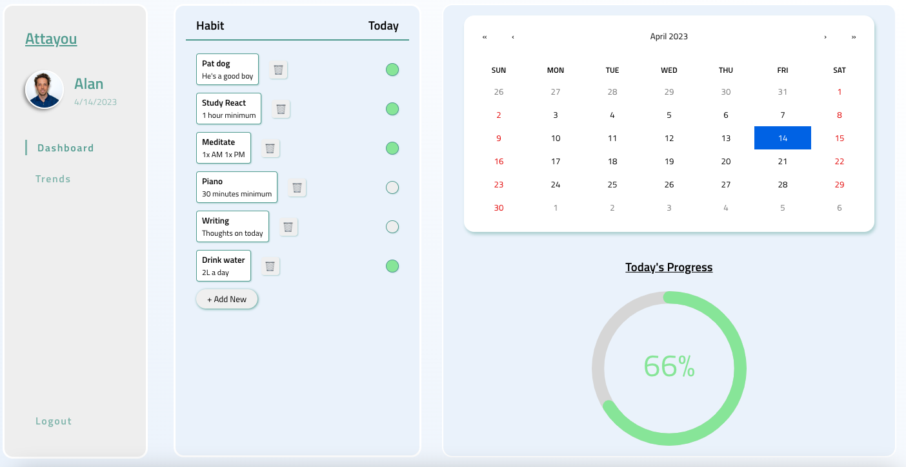
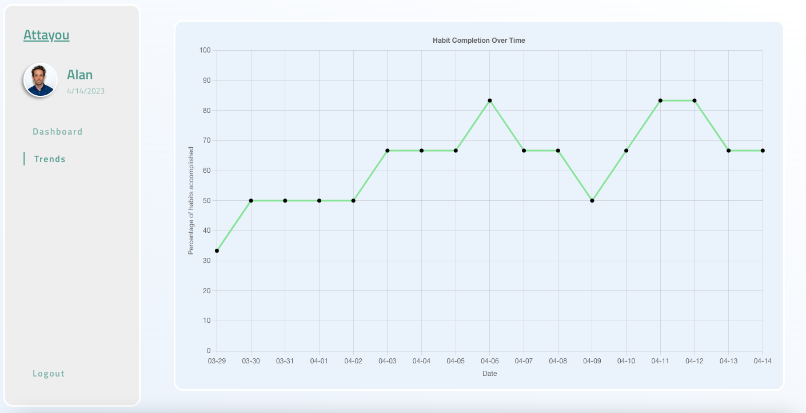

# ATTAYOU

Attayou is a modern, elegant habit tracker app that enables users to track their behaviors as they attempt to foster new good habits or abstain from bad habits.  Users can input custom behaviors they want to track and log their successes over time using a calendar.  Employs a second repo for the backend available at https://github.com/alancashman/attayou-server.  

## Functions

Users must login to access the dashboard view; for demo purposes, use the username 'Alan' and the password 'asdf'.

Users can click the cells corresponding to habits to send a PUT request to the backend to update the 'done' status of the habit for that particular day.  

Users can input their own custom habits to be tracked using the "+ Add New" button to send a POST request to add a new habit to the habits array.

Users can delete habits they no longer wish to track by clicking the trash icon adjacent to the habit in question.  This will send a DELETE request to the backend to remove the habit from the habits array.

Users can set the date by clicking the calendar to pull up the habits completion status for the chosen day.  Progress for the chosen day can be visualized by the progress bar located below the calendar.  

The 'Trends' tab on the navigation can be selected to visualize the user's completion progress over time for the days since the user has begun tracking habits.  The chart automatically updates as the data on the backend does.  

## Tech Stack

React frontend using SCSS for styling.  Backend run via node.js using reading and writing to a JSON file for data.  Libraries employed: [React Circular Progress Bar](https://www.npmjs.com/package/react-circular-progressbar), [React Chart JS](https://react-chartjs-2.js.org/), [React Calendar](https://react-chartjs-2.js.org/).

## Available Scripts

In the project directory, you can run:

### `npm start`

Runs the app in the development mode.  Must also run 'npm start' on the backend in order to have data to access.

